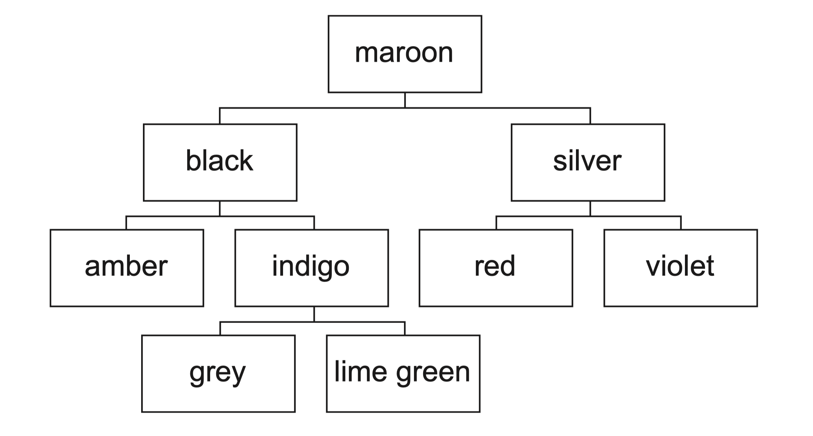

# Paper 4 Further Problem-solving and Programming Skills
## TASK 1 – File storage

Jeff wants a program to help him manage his collection of books. He wants to be able to perform tasks such as search for specific books and add new ones. He has decided he wants a computer program to do this.  

### TASK 1.1
Design a record structure using pseudocode to store data about his books.  
He wants to store the following:  
* unique code for each book (between 100 and 999)
* title of the book
* main author
* year of publication.  

### TASK 1.2
Write program code to:  
* create your record structure
* create an array to store the records about the books
* input data for 10 books from the user
* store each book as a separate record in an array
* output the data in each record with an appropriate message.  

### TASK 1.3
The program needs to store the records in the array into a file.
Write a subroutine to store the records in a serial file.  

### TASK 1.4
Write a procedure to read the records from a serial file and output them with an appropriate message.  

### TASK 1.5
Each book has a unique code. The unique code allows the book’s details to be stored in a random file using a hashing algorithm.  
  
Develop an appropriate hashing algorithm – you may need to research some examples of hashing algorithms.

### TASK 1.6
Manually calculate the file location for several books using your hashing algorithm.

### TASK 1.7
Write a pseudocode algorithm to perform the hash calculation.  

### TASK 1.8
Write a pseudocode algorithm to store a record in its hashed location in the random file.  

### TASK 1.9
Write a pseudocode algorithm to read a record from its hashed location in the random file.  

## TASK 2 – Binary tree
The following is a binary tree, created from a set of data:

### TASK 2.1
Identify the root node and leaf nodes in the binary tree.  

### TASK 2.2
Add the following data to the binary tree:
pink  | yellow  | blue  | purple  | fuchsia  | turquoise

### TASK 2.3
Write program code to store the binary tree as a 1D array of records.  
  
Each record should contain a pointer to the node on its left, a pointer to the node on its right and its data.  

Store the binary tree shown in the array.

### TASK 2.4 
Write program code to add a new data item to the binary tree.

### TASK 2.5
Write program code to find the position of a specific colour in the binary tree.

### TASK 2.6
Write program code to output the contents of the binary tree in alphabetical order.

## TASK 3 – Object-oriented programming (OOP)
A virtual shop in a computer game sells a range of tools such as a spade and a screwdriver.  

The tools are stored on shelves in the virtual shop.

### TASK 3.1 
The program needs a class for the tools.  

The information stored about each tool must include:
* name
* cost
* image file name (e.g. ‘spade.jpeg’).  

Write program code for the class tools.  

The constructor should take all of the attributes as parameters.

Write program code for the attributes and the constructor method.

### TASK 3.2
Write program code to create a get and set method for each of the tool attributes. 

### TASK 3.3
The program needs a class for the shelves in the store.  

Each shelf has the following information:
* position of the shelf on the wall (between 0 and 4)
* array of objects of type tool (maximum of 10 items per shelf).

Write program code for the class shelves.

The constructor should set the position of the shelf but should not set any tools.

Write program code for the attributes and the constructor method.

### TASK 3.4
Write program code for a set method to add a new tool to the shelf in the next available position. 

### TASK 3.5
Write program code to define a procedure that takes a shelf object as a parameter and outputs the name and cost of each tool on that shelf.